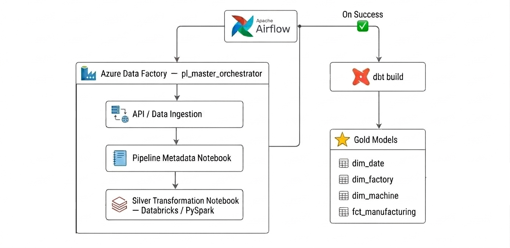
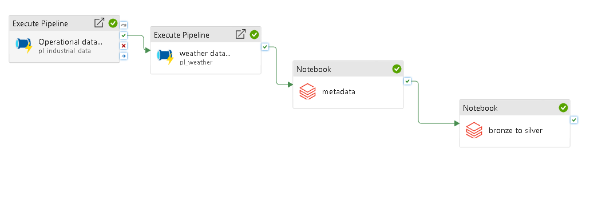
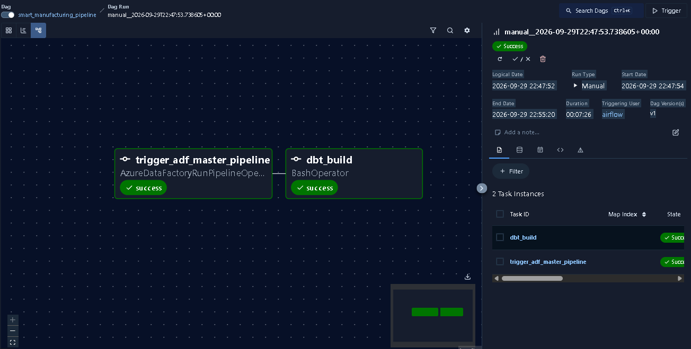

# Smart Manufacturing Data Platform

An end-to-end data engineering platform for transforming smart manufacturing data into analytics-ready datasets.

**Azure Data Factory · ADLS Gen2 · Databricks · PySpark · Delta Lake · dbt · Apache Airflow**

## Architecture



## Pipeline

### Azure Data Factory

Azure Data Factory handles data ingestion and executes the master pipeline.



### Databricks & PySpark

Raw data is processed using PySpark and Delta Lake following a Medallion Architecture.

**Bronze → Silver**

The Silver layer contains cleaned manufacturing data including:

- Factories
- Machines
- Production
- Telemetry
- Maintenance
- Quality inspections
- Weather

### dbt

dbt builds the Gold analytical layer using a **star schema** with:

- `fct_manufacturing`
- `dim_date`
- `dim_factory`
- `dim_machine`

dbt also provides model dependencies and data quality testing.

### Apache Airflow

Airflow provides the top-level orchestration, triggering the Azure Data Factory pipeline first and running the dbt transformation after the ADF pipeline completes successfully.



## Tech Stack

| Area | Technology |
|---|---|
| Ingestion | Azure Data Factory |
| Storage | Azure Data Lake Storage Gen2 |
| Processing | Databricks / PySpark |
| Lakehouse | Delta Lake |
| Data Modeling | dbt |
| Orchestration | Apache Airflow |
| Languages | Python / SQL |

## Project Structure

```text
smart-manufacturing-platform/
├── adf/
├── airflow/
├── data_generation/
├── dbt/
├── notebooks/
├── assets/
│   ├── architecture.png
│   ├── adf.png
│   └── airflow.png
├── README.md
└── pyproject.toml
